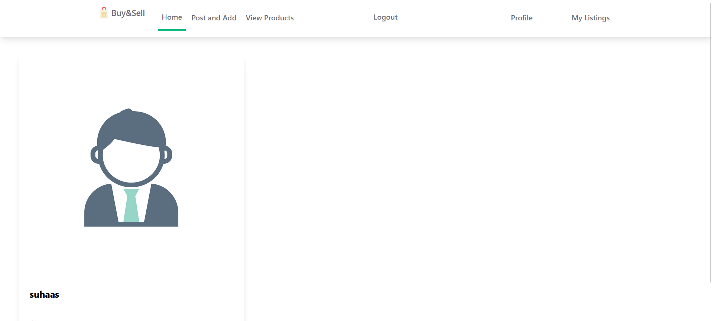

# E-Commerce Web Application 

## This project is an e-commerce web application built using Django and styled with Tailwind CSS. The website facilitates buying and selling products and includes several key functionalities.

### Overview
- **User Features:**
  - Browse products by category
  - View product details and images
  - Add products to cart and manage cart items
  - Checkout process with payment integration
  - User authentication and profile management
  
- **Seller Features:**
  - List products for sale
  - Manage product listings
  
- **Admin Features:**
  - Admin dashboard for managing users, products, and orders
  - View and manage user accounts and permissions
  - Monitor and manage product listings and sales
  
- **Technical Details:**
  - Developed using Django, a Python-based web framework
  - Utilizes Tailwind CSS for responsive and modern styling
  - Integrates Stripe for payment processing and secure transactions
  

## Pages

### Home Page

- Overview of the website
- Featured products or promotions
- Browse products by category
- View product details and images
- Add products to cart

### Product Listings
- Add Products
- Manage product listings
    - Name
    - Price
    - Description
    - Image
- Delete Product

### User Authentication and Profiles

- User login and registration
- Profile management

 

### Admin Dashboard

- Manage users, products, and orders
- Monitor and manage platform activities

### Cart and Checkout

- Manage items in the cart
- Checkout process with payment integration

### This web application is designed to provide a seamless e-commerce experience for both buyers and sellers while offering robust admin support for managing the platform.

